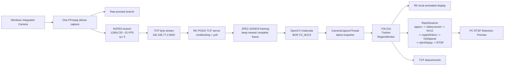

# EdgeVision Network Camera Input 阶段性工作总结

> 阶段：`feature/v3-phase5-pc-preview-rtsp` 的网络摄像头输入收敛阶段
>
> 记录日期：2026-08-18
>
> 代码基线：`19e877d feat: replace H264 network input with JPEG TCP`
>
> 适用平台：Windows PC + RK3568 Ubuntu 20.04
> 文档性质：阶段性设计、实现和验收总结，不是最终产品规格书

## 1. 结论先行

这一阶段已经停止使用 PC 到 RK3568 的 H.264/RTP/UDP/MPP 摄像头输入路线，正式网络摄像头输入改为：

```text
Windows Integrated Camera
    -> one FFmpeg dshow capture owner
    -> MJPEG byte stream over TCP
    -> RK3568 POSIX TCP listening socket :5600
    -> JPEG SOI/EOI frame extraction
    -> OpenCV imdecode(CV_8UC3 BGR)
    -> existing EdgeVision capture/latest-frame pipeline
    -> YOLO11 / Tracker / RegionMonitor / local display
    -> existing RTSP output branch
```

本阶段的关键判断是：

- PC Raw Camera 画面正常。
- NVIDIA H.264 MFT 编码后的本地画质明显下降；libx264 本地解码质量可以接受。
- 同一 RTP/H.264 码流由 RK3568 现有 FFmpeg 软件解码时画面正常。
- 但 RK3568 `mppvideodec` live 解码持续出现大块花屏、`frame not complete`、`resetting`、`no matched frame` 和 PTS 相关警告。
- 为了优先保证秋招演示链路稳定，本阶段不再继续深挖 MPP/H.264 兼容性，也不把软件 H.264 解码接入正式链路，而是选择更简单、可控的 JPEG/TCP 输入。
- RTSP 输出侧的 Rockchip `mpph264enc` 已经稳定，保留不变。

最终实测结果：

| 项目 | 阶段结果 |
|---|---|
| PC 单次摄像头采集 | PASS |
| JPEG/TCP 网络输入 | PASS |
| RK 本地画面 | 连续运行期间无之前的大块 H.264/MPP 花屏 |
| RK 捕获帧率 | 约 14.18 FPS，目标链路约 15 FPS |
| RK Display FPS | 约 15.02 FPS |
| YOLO Detection FPS | 约 5.22 FPS |
| RTSP Detection Preview | PASS |
| TCP / Tracker / RegionMonitor | PASS |
| 客户端断开后重连 | PASS |
| Ctrl+C | PASS |
| 应用重启 | PASS |
| `mppvideodec frame not complete/reset` | 正式输入链中不再出现 |
| 最终决策 | 接受 JPEG/TCP 作为当前网络摄像头输入方案 |

这里的“保留 H.264”只针对 RTSP 输出侧。输入侧已经不再使用 H.264/RTP/MPP；输出侧仍然使用 BGR 到 NV12，再由 `mpph264enc` 硬件编码成 RTSP H.264。

## 2. 系统要解决的问题

EdgeVision 的目标不是单纯把摄像头画面传到开发板，而是把网络画面接入现有视觉检测系统，并保持原有上层能力：

1. PC 端采集 Integrated Camera。
2. RK3568 接收网络画面并恢复为 OpenCV BGR 帧。
3. 既有 YOLO11 检测继续运行。
4. Tracker 和 RegionMonitor 继续消费检测结果。
5. RK3568 本地窗口继续显示结果。
6. 检测结果通过 RTSP 回传到 PC 预览。
7. TCP 状态/事件输出继续可用。
8. 摄像头发送端停止、重新连接、应用 Ctrl+C 和应用重启不能破坏进程生命周期。

因此，网络输入层最重要的接口不是某条固定 GStreamer 字符串，而是既有的 `CaptureInput` 抽象：上层只需要持续获得 `1280x720`、`BGR`、`CV_8UC3` 的 `cv::Mat`，不应该因为底层传输协议改变而重构 YOLO、显示、Tracker 或 TCP 逻辑。

## 3. 原 H.264/RTP/MPP 路线为什么停止

### 3.1 原路线

原先的输入链路是：

```text
PC Integrated Camera
    -> H.264 encoder
    -> RTP over UDP :5600
    -> udpsrc
    -> rtph264depay
    -> h264parse
    -> mppvideodec
    -> BGR / NV12
```

其中：

- `udpsrc` 已经验证通过。
- `rtpjitterbuffer`、`rtph264depay` 已经验证通过。
- `h264parse` 通过离线安装 `gstreamer1.0-plugins-bad` 后可用。
- `mppvideodec` 能被发现并且对应 Rockchip MPP。
- 直接 `rtph264depay -> mppvideodec` 失败的原因已明确：MPP sink caps 要求 `parsed=true`，所以 parser 确实是必要组件。

### 3.2 关键失败证据

在输入侧诊断阶段已经分别比较过：

- PC Raw：正常。
- PC H.264 码流本地软件解码：libx264 方案接近 Raw，可接受。
- RK3568 live MPP 解码：NV12 和 BGR 都出现损坏。
- 同一 RTP/H.264 使用 RK3568 现有 FFmpeg 软件 H.264 解码：画面正常。
- MPP 内核/运行日志反复出现：
  - `frame not complete`
  - `resetting`
  - `no matched frame`
  - `unable to generate pts`
  - MPP 无法正常生成 PTS
- 受控观察窗口内，`eth0` RX error/drop 和 UDP `InErrors/RcvbufErrors` 没有增加，因此没有把 packet loss 作为已证实根因。

这组证据足以说明：当前问题不在 YOLO、overlay、Display 或 RTSP 回传，而是在 H.264 码流进入 live MPP 解码路径之后。继续扫 profile、GOP、parser framing、RTP jitter 或 MPP 参数会增加时间和系统变量，不符合当前阶段“先获得稳定演示链”的目标。

### 3.3 本阶段的决策边界

本阶段明确不做以下工作：

- 不继续研究 `mppvideodec` 的 H.264 兼容性。
- 不把软件 H.264 decoder 建成复杂的子进程或新架构。
- 不换 JPEG 之外的其它协议，例如 SRT、WebRTC、MJPEG HTTP、裸 NV12。
- 不处理 640×384、RGA、码率扫描、分辨率优化和 RTSP 重构。
- 不重写 YOLO11、Tracker、RegionMonitor 或本地显示。

## 4. 当前完整系统架构



### 4.1 两条视频方向

系统现在有两条独立的视频方向，不能混淆。

#### 输入方向：PC 到 RK3568

```text
Camera -> FFmpeg MJPEG -> TCP -> POSIX socket -> OpenCV JPEG decode -> BGR
```

这一方向的目的，是把画面稳定地交给 EdgeVision 主链。它不使用 GStreamer 输入 pipeline，也不使用 `mppvideodec`。

#### 输出方向：RK3568 到 PC

```text
Annotated BGR -> appsrc -> videoconvert -> NV12
             -> mpph264enc -> h264parse -> rtph264pay -> RTSP
```

这一方向继续使用 Rockchip 硬件 H.264 编码。它是已经通过验证的 Phase 5 输出能力，本阶段没有删除或重构。

## 5. PC 端发送器设计

实现文件：

- `tools/phase6_pc_jpeg_tcp.ps1`

### 5.1 单一摄像头所有者

Windows 摄像头不能被多个独立流程可靠地同时打开，因此脚本只启动一个 FFmpeg 进程拥有摄像头：

```text
Integrated Camera
    -> dshow
    -> split=2
        -> raw preview
        -> JPEG/TCP sender
```

这样 Raw Preview 和网络发送使用同一次采集，不会因为两个进程分别打开摄像头而造成设备冲突、帧不同步或格式协商差异。

### 5.2 固定采集和编码配置

当前脚本固定使用：

| 参数 | 当前值 |
|---|---|
| 输入设备 | `Integrated Camera` |
| dshow 分辨率 | `1280x720` |
| dshow 输入帧率 | `30` |
| 网络输出帧率 | 约 `15 FPS` |
| 编码格式 | `MJPEG` |
| JPEG 质量 | `-q:v 3` |
| 目标地址 | `192.168.77.2:5600` |
| 传输 | TCP |
| TCP 选项 | `tcp_nodelay=1` |

网络分支是：

```text
[jpeg0]fps=15[jpeg]
    -> -q:v 3
    -> -c:v mjpeg
    -> -f mjpeg
    -> tcp://192.168.77.2:5600?tcp_nodelay=1
```

这里的 `-f mjpeg` 是连续 JPEG 图片字节流，不是 H.264，也不是 RTP。每一帧 JPEG 自带 `FF D8` 起始标记和 `FF D9` 结束标记，RK 端利用这两个标记恢复帧边界。

### 5.3 Raw Preview 分支

默认情况下，FFmpeg 把同一次采集的 raw 分支输出为 NUT 管道，交给 `ffplay` 显示；如果当前 Windows FFmpeg 包没有 `ffplay`，脚本尝试使用同一 FFmpeg 构建的 SDL 输出作为 fallback。

无显示或板端压力测试时可以使用：

```powershell
.\tools\phase6_pc_jpeg_tcp.ps1 -NoRawPreview
```

这只关闭 PC 本地预览窗口，不改变网络 JPEG 分支，也不会再次打开摄像头。

### 5.4 为什么不继续使用原 H.264 sender

H.264 在带宽效率上更好，但当前目标首先是获得稳定的输入画面。NVIDIA MFT 路线存在本地画质下降和 RK MPP live decode 花屏；libx264 虽然改善了 PC 本地质量，但没有解决 MPP 解码 reset。因此，本阶段固定采用一个已经可接受的 JPEG 质量值，不再扫描率、GOP、profile 或延迟参数。

## 6. RK3568 网络输入实现

实现文件：

- `include/edgevision/network_camera_source.hpp`
- `src/network_camera_source.cpp`

### 6.1 对上层保持的接口

`NetworkCameraSource` 继续提供与原输入适配层相同的生命周期和读取接口：

```cpp
void open();
bool read(cv::Mat& frame);
void release();
bool is_opened() const;
int port() const;
const std::string& pipeline() const;
const CameraSourceInfo& info() const;
```

上层不需要知道底层是 H.264、JPEG、GStreamer 还是 POSIX socket；它只依赖 `read()` 返回合法的 BGR 帧。

### 6.2 `open()`：创建 TCP 监听端

Linux 下 `open()` 的行为：

1. 创建 `AF_INET/SOCK_STREAM` socket。
2. 设置 `SO_REUSEADDR`，便于进程重启后快速重新绑定端口。
3. 设置 non-blocking。
4. 绑定 `0.0.0.0:5600`。
5. `listen(fd, 1)`，当前只支持一个发送端。
6. 清空旧 client 和旧 stream buffer。
7. 写入输入元信息：
   - width：1280
   - height：720
   - fps：15.0（目标值）
   - backend：`POSIX TCP/MJPEG/OpenCV`
   - pixel format：`BGR`
   - plane count：1

在非 Linux 构建环境中，当前实现会明确报错：

```text
JPEG/TCP network input requires the Linux socket backend
```

这是有意的边界：正式 Network Camera 输入运行在 RK3568 Linux，不额外为 Windows 构造一套无意义的服务端后端。

### 6.3 `read()`：poll + recv，避免永久阻塞

`read()` 不直接调用可能永久阻塞的 `recv()`，而是：

1. 先检查是否已有完整 JPEG 在缓冲区。
2. 没有完整帧时，用 `poll()` 等待 server socket 或 client socket，单次等待 100 ms。
3. 没有 client 时接受一个新连接。
4. 有 client 时读取最多 64 KiB 的 TCP 数据块。
5. 把数据追加到内部连续字节缓冲区。
6. 再次尝试提取最新完整 JPEG。

这种设计有两个直接收益：

- `release()` 可以通过关闭 socket 中断等待中的读取，Ctrl+C 不必等网络超时结束。
- TCP 发送端断开后，`POLLHUP`、EOF 或 socket error 会被识别，应用可以进入既有的重连/重新打开逻辑。

### 6.4 JPEG 帧边界恢复

TCP 本身只提供有序字节流，不保证一次 `recv()` 对应一帧图片。实现不能把一次网络读取直接当成一张 JPEG，而是使用 JPEG 标记解析：

```text
FF D8  ... JPEG payload ...  FF D9
^                              ^
SOI                            EOI
```

算法会在当前缓冲区中搜索所有已经闭合的 `SOI -> EOI` 区间，选择最后一个完整区间作为下一帧：

```text
buffer = [old JPEG][old JPEG][latest complete JPEG][partial JPEG]
                                  ^
                                  return this one
```

提取后删除已消费的前缀，未完成的尾部 JPEG 保留到下一次 `recv()`。如果长期收不到完整帧，缓冲区超过 16 MiB 时会做保护性裁剪，避免异常发送端造成无界内存增长。

### 6.5 为什么只取最新完整 JPEG

EdgeVision 的检测和显示不需要把网络历史帧逐张补完。若消费速度短时间低于发送速度，严格 FIFO 会把旧帧堆积起来，最终表现为画面越来越滞后。

因此当前策略是：

- 保证只返回完整 JPEG。
- 在已有多张完整 JPEG 时跳过旧帧，尽快返回最新完整帧。
- 允许少量帧被丢弃，以换取实时性和有界延迟。

这不是“补偿网络丢包”的逻辑；它只是在 TCP 字节流已经完整到达的前提下主动丢弃过时画面。JPEG 的每一帧独立可解码，所以丢掉旧 JPEG 不会影响新 JPEG 的解码。

### 6.6 OpenCV 解码和格式契约

提取 JPEG 后使用：

```cpp
cv::imdecode(jpeg, cv::IMREAD_COLOR)
```

随后强制检查：

```text
width  == 1280
height == 720
type   == CV_8UC3
```

因此 `NetworkCameraSource::read()` 的输出契约是：

```text
cv::Mat: 1280x720, 8-bit unsigned, 3-channel BGR
```

这与现有 YOLO11、OpenCV overlay、本地窗口和 RTSP `appsrc` 的输入约定一致，不需要在上层增加颜色转换或尺寸分支。

### 6.7 生命周期和连接切换

当前只保留一个 client fd：

- 新 client 接入时，如果已有旧 client，会先关闭旧 client。
- 发送端 EOF、HUP、错误或连续读取失败时，client 被清理，缓冲区清空。
- `CameraCaptureThread` 连续 5 次读取失败后调用 `release()`，等待 500 ms，再重新 `open()`。
- 停止信号在等待前后都检查，避免 Ctrl+C 之后又重新打开 socket。

这实现了当前阶段所需的“发送端可断开、随后可重连”，但没有引入多客户端、鉴权或复杂会话状态机。

## 7. 为什么最终使用直接 POSIX socket，而不是 GStreamer 输入链

阶段中曾经做过 GStreamer `tcpserversrc`/JPEG 解码的最小 PoC，它可以得到约 15 FPS 的 JPEG 帧；但在发送端断开、应用退出和 GStreamer pipeline 清理的组合场景中，曾观察到 core/hang 风险。

最终正式实现改成直接 POSIX socket + OpenCV `imdecode`，原因是：

1. 依赖更少，不需要在正式输入链里依赖 `tcpserversrc`、`jpegparse`、`jpegdec`、appsink 等插件生命周期。
2. TCP 连接状态、EOF、HUP 和退出行为可以直接控制。
3. `release()` 可以明确关闭 fd，打断 `poll()`。
4. JPEG 帧边界和“只取最新帧”策略由应用直接管理。
5. 对上层仍然只暴露 BGR `cv::Mat`，没有扩大架构接口。

这里的 `pipeline()` 仍保留一个描述性字符串，便于日志和诊断：

```text
tcp-server-mjpeg port=5600 ! jpeg SOI/EOI framing ! OpenCV imdecode(BGR)
```

它不是实际交给 GStreamer 执行的 pipeline；正式输入后端是 C++ POSIX socket。

## 8. 现有 EdgeVision 主链如何复用

### 8.1 `CaptureInput` 适配层

`src/application.cpp` 中仍然有统一的输入抽象：

```text
CaptureInput
    ├─ LocalCaptureInput      -> CameraSource
    └─ NetworkCaptureInput    -> NetworkCameraSource
```

Network 模式仅把底层对象改为 TCP/JPEG 版本，并将展示名称从：

```text
udp://0.0.0.0:5600
```

改成：

```text
tcp://0.0.0.0:5600
```

上层主循环没有因为输入协议切换而重写。

### 8.2 捕获线程和最新帧快照

捕获线程负责：

1. 打开输入。
2. 循环读取 BGR 帧。
3. 检查尺寸和类型。
4. 给帧分配递增 sequence。
5. 记录 `captured_at` 时间点。
6. 把完成的 `cv::Mat` 移入共享快照。

核心策略是单个 latest snapshot，而不是无限队列：

```text
NetworkCameraSource.read()
    -> completed cv::Mat
    -> immutable shared CameraFrameSnapshot
    -> replace latest_
    -> display / AI consumers read latest available snapshot
```

当消费者来不及处理时，新帧会覆盖尚未消费的旧快照，并增加 `overwritten_frames` 统计。这样可以避免 AI 推理变慢后，整条链路出现持续积压。

### 8.3 采集线程的异常恢复

普通单次读失败不会立即让应用退出，而是累计连续失败次数：

```text
read failure x 5
    -> release input
    -> wait 500 ms, interruptible
    -> reopen input
```

这套逻辑适合当前“PC sender 可能停止后再启动”的演示场景。若是输入尺寸/类型严重错误，则直接把错误上报为 capture failure，因为这属于配置或协议契约错误，不应静默循环。

### 8.4 停止流程

Ctrl+C 的流程是：

```text
SIGINT
    -> global stop flag
    -> CameraCaptureThread::request_stop()
    -> NetworkCameraSource::release()
    -> shutdown/close client and server fd
    -> wake poll/read
    -> join capture thread
    -> stop AI / display / RTSP workers
    -> exit
```

直接 socket 后，退出不需要等待一个不可打断的网络读操作，也不需要依赖 GStreamer pipeline 从 PLAYING 状态退回 READY 的复杂清理。

## 9. YOLO11、Tracker、RegionMonitor 和显示

网络输入替换发生在采集边界，后面仍然是原有 EdgeVision 逻辑：

```text
latest BGR snapshot
    ├─ realtime display path
    │   ├─ 复制/准备当前画面
    │   ├─ 叠加最新可用检测结果
    │   └─ OpenCV local display
    │
    └─ smooth AI worker
        ├─ 取可用最新帧
        ├─ YOLO11 preprocess/inference/postprocess
        ├─ Tracker 更新轨迹
        ├─ RegionMonitor 更新区域事件
        ├─ TCP status/event 输出
        └─ 发布带检测框的结果快照
```

显示和检测不是严格一帧一推理：

- Capture 目标约 15 FPS。
- Display 可以持续显示最新帧。
- YOLO11 按设备性能以约 5 FPS 完成推理。
- 未完成检测时，显示可以继续使用最新一组检测结果。
- 这解释了“Display FPS 高于 Detection FPS”是正常设计结果，而不是重复处理或积压。

这一阶段没有改变 YOLO 模型、输入尺寸、Tracker 状态机、RegionMonitor 规则或 TCP 消息协议。

## 10. RTSP 输出系统

实现仍由 `RtspStreamer` 负责，当前输出地址为：

```text
rtsp://192.168.77.2:8554/live
```

### 10.1 输出 pipeline

当前核心 pipeline：

```text
appsrc
    caps=video/x-raw,format=BGR,width=1280,height=720,framerate=15/1
    -> videoconvert
    -> video/x-raw,format=NV12,width=1280,height=720,framerate=15/1
    -> mpph264enc bps=6000000 gop=15 header-mode=each-idr
    -> h264parse
    -> rtph264pay pt=96 config-interval=1
    -> RTSP server :8554/live
```

### 10.2 为什么 RTSP 侧仍然使用 H.264/MPP

当前已经验证过：

- BGR 直接进入 `mpph264enc` 长时间不稳定。
- BGR 先经过 `videoconvert` 转成 NV12，再进入 `mpph264enc`，可以稳定运行。
- RTSP 客户端可以连续收到 1280x720、约 15 FPS 的 H.264。

所以本阶段只替换输入侧，不触碰输出侧已稳定的转换链。输入侧的 `h264parse` 已经不再需要；RTSP 输出侧仍然需要 `h264parse`，这是两个不同位置的插件依赖。

### 10.3 RTSP 客户端断开和重连

`RtspStreamer` 使用 shared media，并保留 appsrc/MPP encoder 生命周期，以避免每次客户端断开都重新初始化 Rockchip encoder。阶段验收中 PC FFmpeg RTSP 客户端可以正常连接并读取；输入重连和 RTSP 输出重连也没有要求重构上层采集逻辑。

## 11. 运行方式

### 11.1 RK3568 启动 EdgeVision

实际使用的参数取决于板端模型和 labels 路径，通用形式为：

```bash
./build-native/edge_vision \
  --model /path/to/model.rknn \
  --labels /path/to/labels.txt \
  --input network \
  --show \
  --tcp
```

Network 模式监听：

```text
0.0.0.0:5600/TCP
```

RTSP 输出由应用启动后提供：

```text
rtsp://192.168.77.2:8554/live
```

### 11.2 Windows PC 启动发送器

在 PowerShell 中：

```powershell
.\tools\phase6_pc_jpeg_tcp.ps1 -FfmpegPath "C:/path/to/ffmpeg.exe" -FfplayPath "C:/path/to/ffplay.exe"
```

无 Raw Preview 的发送模式：

```powershell
.\tools\phase6_pc_jpeg_tcp.ps1 -FfmpegPath "C:/path/to/ffmpeg.exe" -NoRawPreview
```

如果需要限制一次 PoC 的运行时间，可传入：

```powershell
-DurationSeconds 60
```

发送端目标地址目前固定在脚本中：

```text
192.168.77.2:5600
```

### 11.3 PC 查看 RTSP 结果

ffplay/VLC 均可使用：

```text
rtsp://192.168.77.2:8554/live
```

阶段验证中也使用了 FFmpeg 无显示接收方式：

```powershell
ffmpeg -rtsp_transport tcp -i rtsp://192.168.77.2:8554/live -t 12 -an -f null NUL
```

## 12. 阶段性验证记录

### 12.1 JPEG/TCP 最小 PoC

在正式 C++ socket 后端落地前，先用最小接收链验证了传输方向：

```text
TCP MJPEG
    -> JPEG decode
    -> BGR
    -> frame rate observation
```

结果：

- 约 10 秒窗口收到 150 帧。
- 解码速率约 15 FPS。
- `eth0` RX 增量约 13.16 MB，折算约 10.5 Mbps。
- 平均每帧约 88 KB，符合当前 1280x720、`q:v 3` JPEG 方案的量级。
- 抽取的 JPEG 静态帧人工查看无明显块状损坏。

这个 PoC 只用于验证发送格式、网络方向和 JPEG 解码可行性；正式输入采用随后完成的 POSIX socket 实现。

### 12.2 正式直接 socket 连续运行

一次约 129/130 秒的正式 EdgeVision 运行记录如下：

| 指标 | 实测值 |
|---|---:|
| displayed frames | 1828 |
| captured frames | 1829 |
| submitted frames | 636 |
| skipped frames | 1192 |
| completed inferences | 635 |
| display FPS | 15.020498 |
| detection FPS | 5.217733 |
| capture FPS | 14.183463 |
| display result age average | 105.20 ms |
| display result age max | 304.03 ms |
| overwritten frames | 1 |
| capture read average | 约 68.53 ms |

这些数字体现了当前架构的工作方式：显示接近 15 FPS，YOLO 约 5 FPS；大量 `skipped_frames` 是 AI worker 忙时跳过过时提交，不是 TCP 接收队列无限增长。

### 12.3 CPU 观察

板端中途采样到 `edge_vision` 进程约 92.9% Linux `%CPU`。这是四核设备上的进程总占用口径，粗略相当于平均每核约 23%，不是单核 92.9%。早期采样约在 87.5% 到 99.1% 范围内波动。

在该占用水平下：

- 系统没有出现持续失稳。
- Display 和 Detection 仍保持目标量级。
- 没有因为 JPEG 输入导致应用退出或持续错误。

JPEG 解码是软件路径，因此 CPU 成本高于理想的硬件 H.264 输入；这是当前用带宽和 CPU 换取输入可靠性的明确取舍。

### 12.4 RTSP 输出接收

PC 使用 FFmpeg 接收：

```text
ffmpeg -rtsp_transport tcp -i rtsp://192.168.77.2:8554/live -t 12 -an -f null NUL
```

成功运行结果：

- 输入识别为 H.264 High、`yuv420p`、1280x720、15 FPS。
- 约 11.93 秒收到 181 帧。
- FFmpeg 正常退出，exit code 为 0。

阶段中有一次客户端在服务端/输入链尚未完全 ready 时过早连接，收到 503；重启发送端并在服务端 ready 后连接即成功。这是启动时序问题，不是正式运行中的持续 RTSP 故障。

### 12.5 断开、重连、Ctrl+C 和重启

受控验证包含：

1. 启动 RK 应用。
2. 启动第一个 PC JPEG/TCP sender，运行约 30 秒。
3. 停止 sender，确认网络输入进入失败/重开流程。
4. 启动第二个 sender，运行约 45 秒。
5. 使用 `ss` 确认新的 TCP client 已经 ESTABLISHED 到 5600。
6. 对 RK 应用发送 Ctrl+C。
7. 再次启动应用，确认端口和主链可以重新建立。

结果：

- sender 断开后，应用没有崩溃。
- 第二个 sender 可以重新连接。
- 应用可以正常 Ctrl+C 退出。
- 应用可以重新启动并重新监听端口。
- 最终直接 socket 后端没有复现此前 GStreamer 输入清理阶段的 core/hang 问题。

启动阶段在 PC sender 尚未连接时，日志中出现过少量 `camera input reopened after read failure`；sender 稳定连接后没有持续重开。

### 12.6 编译和测试

板端执行：

```bash
cmake --build build-native -j2
build-native/edgevision_tests
```

结果：

- Native build：PASS。
- 单元测试：PASS。
- `test_network_camera_source`：验证默认端口、描述性 pipeline 中的 SOI/EOI framing 和 OpenCV BGR 解码约定，并确认正式输入描述中没有 `tcpserversrc`、`mppvideodec`、`rtph264depay` 或 `appsink`。
- 测试期间已有 `test_video_io` 的 OpenCV bad-input warning 属于测试刻意覆盖非法输入的既有输出，不是 JPEG/TCP 网络输入错误。

## 13. 代码改动清单

对应基线提交 `19e877d` 的正式改动为：

| 文件 | 改动内容 |
|---|---|
| `include/edgevision/network_camera_source.hpp` | 将网络源内部模型改为 POSIX TCP server、client 生命周期和 JPEG 缓冲区 |
| `src/network_camera_source.cpp` | 实现 nonblocking socket、poll、连接接受、SOI/EOI 提取、最新 JPEG 选择、OpenCV BGR 解码、release 中断 |
| `src/application.cpp` | 网络输入名称改为 TCP；保留 CaptureInput/最新帧设计；补充停止前重开检查 |
| `tests/test_network_camera_source.cpp` | 验证 JPEG/TCP 描述和旧 H.264/GStreamer 输入组件不再出现在正式输入描述中 |
| `tools/phase6_pc_jpeg_tcp.ps1` | 从旧 Phase 5 H.264 sender 改为单采集拥有者 + MJPEG/TCP sender + Raw Preview |
| `docs/v3-network-camera-input-summary.md` | 更新为当前 JPEG/TCP 网络输入简版说明 |

脚本文件是从旧名称重命名而来：

```text
tools/phase5_pc_preview.ps1
    -> tools/phase6_pc_jpeg_tcp.ps1
```

本次阶段没有修改：

- YOLO11 模型和推理代码。
- Tracker。
- RegionMonitor。
- TCP 状态/事件协议。
- 本地显示主逻辑。
- `RtspStreamer` 的正式输出实现。
- RTSP 输出 GStreamer 依赖和 `mpph264enc` 路径。
- CMake 架构。

## 14. 设计取舍和当前限制

### 14.1 带宽高于 H.264

实测当前 JPEG 方案约 10.5 Mbps，明显高于同分辨率 H.264 的通常带宽。它换来的收益是：

- 每帧独立，不需要 H.264 parser/AU/PTS/DPB 维护。
- 不依赖 RK3568 `mppvideodec`。
- 单帧损坏不会污染后续帧。
- TCP 保证字节顺序和重传。
- 帧边界可由 JPEG 标记恢复。

对当前千兆/直连网段演示环境，这是可接受的阶段性取舍；它不是最终带宽优化方案。

### 14.2 CPU 高于硬件 H.264 输入

RK 端使用 OpenCV 软件 JPEG 解码。它不使用 MPP 输入解码，因此 CPU 占用会高于理想的硬件视频解码路径。当前实测没有达到影响系统稳定的程度，但如果将来要扩展到更高分辨率、更高帧率或多路摄像头，需要重新评估。

### 14.3 单客户端

当前 `listen(1)` 和单 `client_fd_` 设计只服务一个 PC sender。新连接会替换旧连接，不提供多路摄像头、广播或客户端鉴权。

### 14.4 JPEG SOI/EOI framing 的适用范围

当前 PC sender 输出的是连续独立 JPEG，使用 `FF D8` 和 `FF D9` 做边界恢复。该方案适合当前固定的 MJPEG byte stream，但不是完整的 HTTP multipart MJPEG 解析器，也不是通用媒体容器解析器。

### 14.5 固定配置

当前脚本将目标 IP、端口、分辨率、15 FPS 和 `q:v 3` 固定在当前演示方案内。这样可以减少实验变量；如果后续产品化，需要再决定哪些配置应该进入命令行、配置文件或设备发现机制。

### 14.6 启动时序

推荐顺序是：

```text
先启动 RK EdgeVision
    -> 确认 5600/TCP 已监听
    -> 再启动 PC sender
    -> 确认 RTSP server ready 后再打开 PC RTSP preview
```

虽然输入侧支持 sender 断开和重连，但先启动服务端可以减少首连接时序噪声。

## 15. 清理和保留范围

一次性诊断产生的图片、临时 probe 目录和旧软件解码对照产物已经清理，包括：

- corruption layer diagnosis 临时目录。
- offline MPP / libx264 comparison / software decode evidence 临时目录。
- 单次 JPEG probe 帧和 probe sender 脚本。
- 板端 `/tmp` 临时日志和旧备份二进制。

保留的内容：

- 正式源码。
- `tools/phase6_pc_jpeg_tcp.ps1`。
- 当前网络输入简版文档。
- `docs/phase5-rtsp-plan.md` 及 RTSP 输出相关依赖说明。
- 正式 RTSP 输出实现和 `mpph264enc` 使用路径。

因此，仓库中仍可能出现 `h264parse`、H.264 或 RTP 字样，但它们属于 RTSP 输出侧或历史验证文档，不代表当前 PC 到 RK3568 的正式摄像头输入仍在使用 H.264/RTP/MPP。

## 16. 后续可选工作（本阶段未实施）

如果后续需要产品化或进一步降低资源占用，候选方向可以按优先级考虑：

1. 为 PC sender 增加目标地址、端口、JPEG 质量和网络帧率的显式参数，同时保持默认值不变。
2. 为 NetworkCameraSource 增加更清晰的接收统计，例如连接次数、完整 JPEG 数、跳过旧 JPEG 数、解码失败数和最近一帧时间。
3. 在不改变 latest-frame 语义的前提下，评估 JPEG 质量与带宽/CPU 的单点配置，而不是重新大范围扫参。

本阶段不建议重新打开已经停止的 MPP/H.264 兼容性调查，除非出现新的硬件平台、厂家驱动或完整的可复现修复证据。

## 17. 最终状态

```text
PC RAW CAMERA                         PASS
PC -> RK JPEG/TCP INPUT               PASS
RK NETWORK CAMERA OUTPUT              1280x720 BGR CV_8UC3
RK LOCAL DISPLAY                      CLEAN during acceptance run
YOLO11                                PASS
TRACKER                               PASS
REGION MONITOR                        PASS
TCP STATUS/EVENTS                     PASS
RK -> PC RTSP DETECTION PREVIEW       PASS
RTSP OUTPUT ENCODER                   Rockchip mpph264enc
H264/RTP/MPP INPUT                    REMOVED FROM FORMAL PATH
mppvideodec frame not complete/reset  NO in final formal input run
CTRL+C                                PASS
RESTART                               PASS

FINAL JPEG/TCP NETWORK INPUT          ACCEPT
READY FOR CONTINUED EDGEVISION DEMO   YES
```

### 一句话总结

当前 EdgeVision 已经把不稳定的“PC H.264/RTP 到 RK MPP 解码”输入链替换为“单次摄像头采集、JPEG/TCP 连续字节流、RK 端直接 socket 收包和 OpenCV 解码”的稳定链路，同时保留了原有 BGR 主链、YOLO11、Tracker、RegionMonitor、本地显示、TCP 和 RK 硬件 RTSP 输出；这为后续演示和继续开发提供了一个可运行、可重连、可退出的基线。
